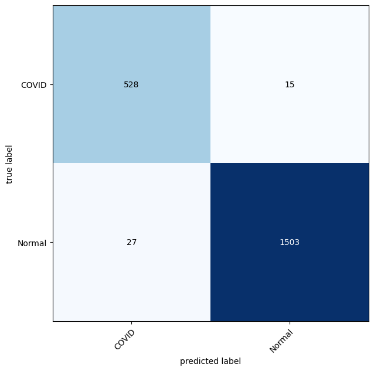

🧠 COVID Image Classification with PyTorch

This project uses deep learning techniques (via PyTorch) to classify medical images related to COVID-19. It includes preprocessing, model training, and performance evaluation steps using image datasets, primarily structured for use in research or educational purposes.

## 📦 Requirements

* Python 3.8+
* PyTorch
* torchvision
* matplotlib
* PIL

## 🗂️ Project Structure

* **Data loading**: Custom `ImageFolder` loaders using torchvision
* **Transformations**: Image preprocessing with `transforms.Compose`
* **Model**: A pre-trained CNN (ResNet50 , VGG19) adapted for binary/multiclass classification
* **Training**: Uses standard PyTorch training loop with accuracy/loss tracking
* **Evaluation**: Includes model evaluation and visualization with matplotlib

### 🚀 Getting Started

1. Download dataset from `kaggle`: https://www.kaggle.com/datasets/tawsifurrahman/covid19-radiography-database

2. Run the Jupyter notebook:

3. Follow the cells to train and evaluate your model.

## 📊 Output

* Predicitons :
   
  
* Confusion Matrix:
   
  

## 📄 License

This project is open-source and available under the MIT License.
